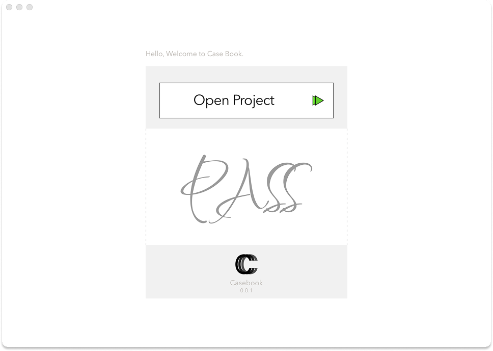
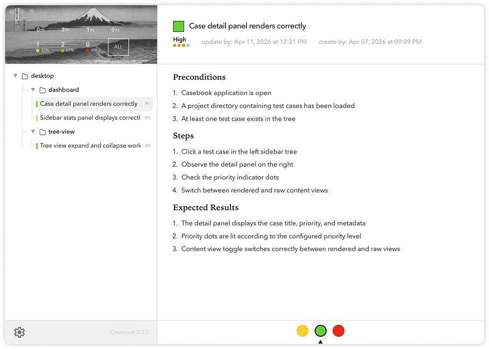

# Casebook

<p align="center">
  
</p>

Casebook is a desktop app for browsing and maintaining Markdown test cases stored inside your repository.
It keeps the case library close to the codebase, with `casebook/tests` as the source of truth.

Instead of moving QA content into a separate tool, Casebook turns plain-text case files into a readable desktop workspace with structure, rendering, timestamps, and workflow status updates.

## Preview

<p align="center">
  
  
</p>

## Why Casebook

- Test cases stay in Git as plain Markdown files.
- The case library lives next to the product context it describes.
- The desktop UI is easier to read and maintain than raw files.
- Your source of truth remains portable and repo-native.

## What It Does

- Open a local project directory.
- Bootstrap a minimal `casebook/` structure when missing.
- Scan `casebook/tests` recursively for Markdown case files.
- Render case content and surface parse warnings.
- Show created and updated timestamps for each case.
- Update case workflow status directly from the app.

## Project Structure

Casebook reads cases from a `casebook/` directory inside your project:

```text
your-project/
└── casebook/
    ├── config.yml
    └── tests/
        └── ...
```

`casebook/tests/` is the source of truth for all case files.

## Case Format

Each case is a Markdown file with YAML frontmatter.

Required fields:

- `title`
- `platform`

Optional fields:

- `priority`
- `status`

Example:

```md
---
title: Open a project and load the case library
platform: desktop
priority: P1
status: todo
---

## Steps

1. Launch Casebook.
2. Choose the local project directory.
3. Wait for the scan to complete.

## Expected Result

- Casebook displays the library tree.
- The case is available in the detail view.
```
